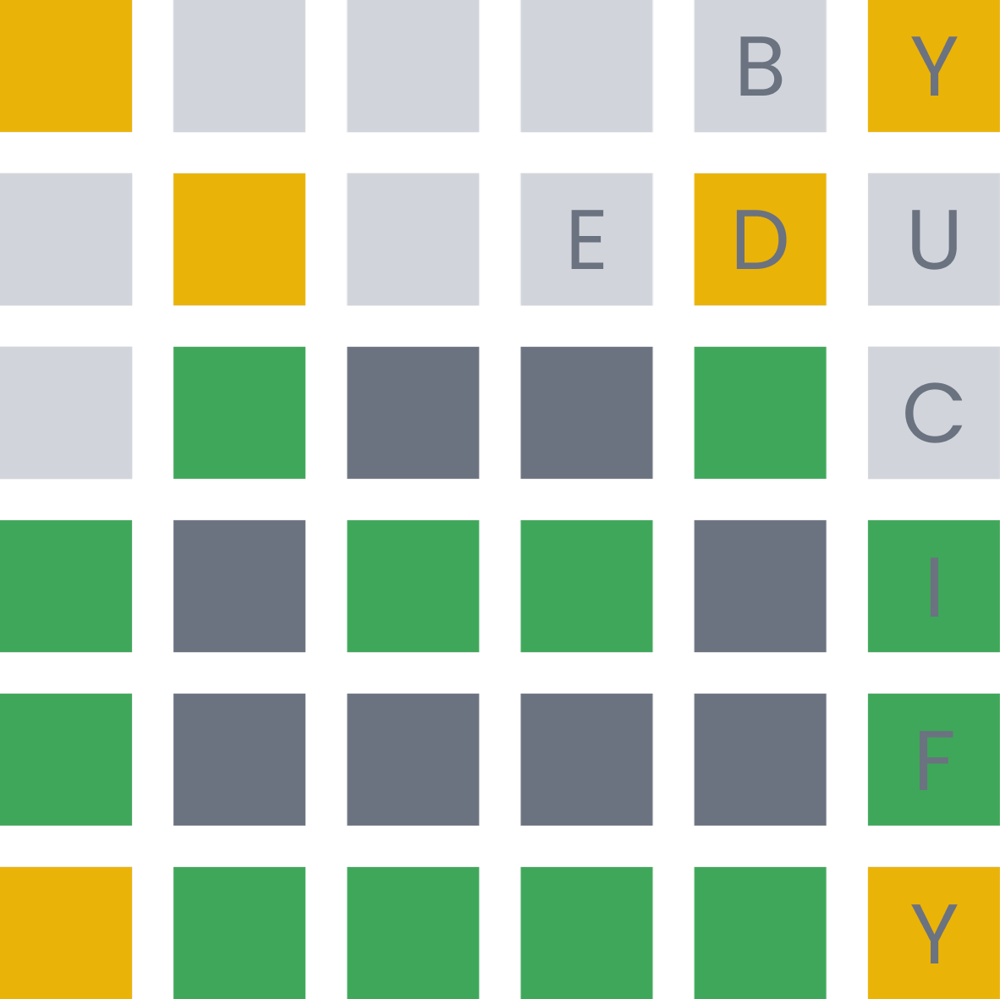
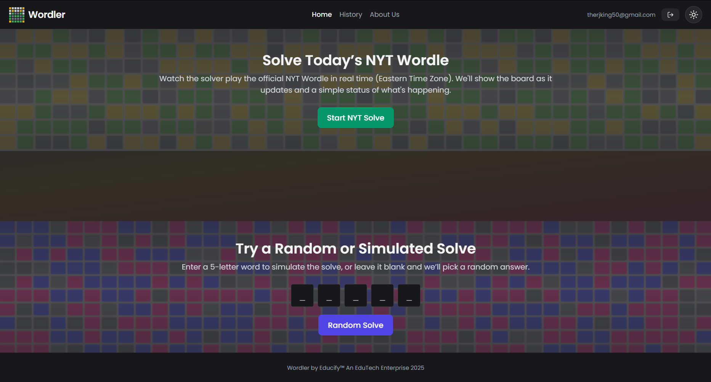
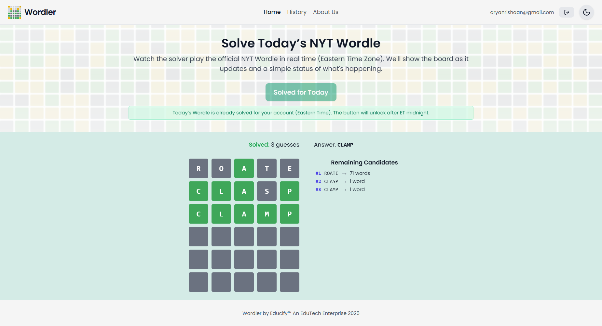
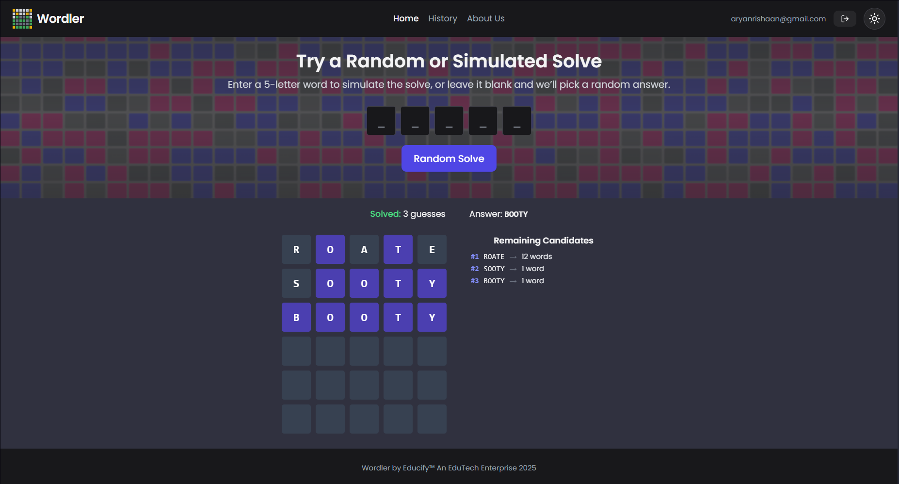
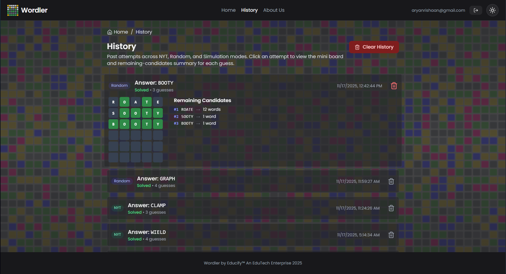
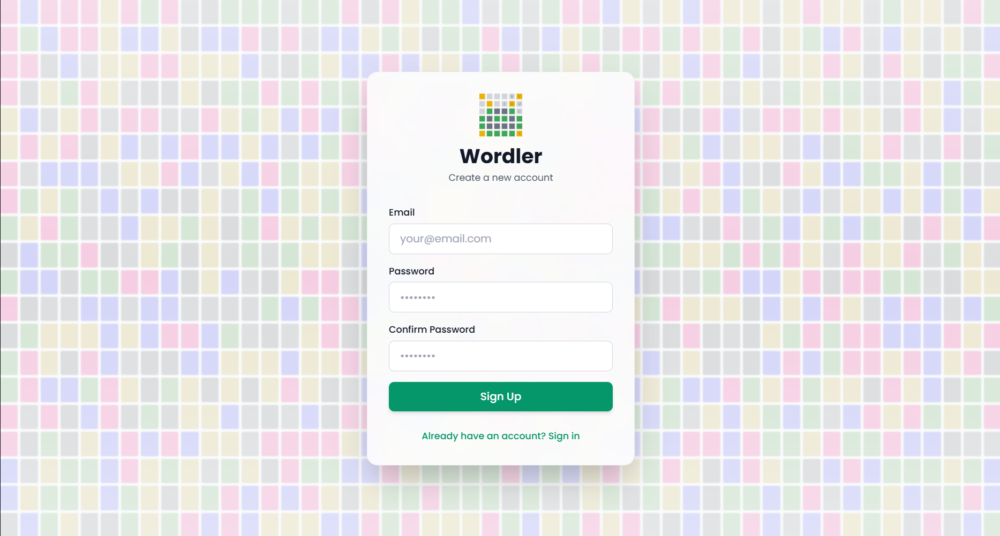

#  Wordler

<!-- Logo (place `assets/Logo.png` here) -->
<p align="center">
  
</p>

<p align="center">
  
  
  
  
  
  
  
  
  
  
</p>

A compact, practical Wordle solver and demo UI built with Vite, React and TypeScript. Wordler implements an entropy-based, deterministic solver (no ML) that shows full decision steps and can optionally drive the official NYT Wordle using Playwright for live demos.




<p align="center">
  <a href="https://wordler-app.web.app" target="_blank" rel="noopener noreferrer">
    
  </a>
</p>

---

## Demos

- NYT live solver (SSE stream)

  

- Simulation / Random solve UI

  

---

## Introduction

Wordler runs a solver engine that:

- Keeps a candidate answer set consistent with observed (guess, pattern) pairs.
- Scores potential guesses by expected information (entropy) across remaining candidates.
- Picks the highest-scoring guess (with reduced-pool fallbacks when candidate sets are large for performance).

The UI shows each guess, the G/Y/B pattern, remaining candidate count, and optional rationale logs.

---

## Frameworks & Tools

- **Frontend:** React, Vite, TypeScript, Tailwind CSS
- **Server:** Node, Express, Playwright (Chromium) for automation
- **Dev & deploy:** Docker (Playwright base), Render (API host), Git
- **Firebase:** Authentication, Firestore (Database), Hosting, Firebase CLI, Web App

---

## Features & Modules

 - **Smart entropy-based solver:** deterministic, explains each guess and shows remaining candidates.
 - **Flexible wordlist handling:** frontend lazy-loads canonical lists with a fast local fallback so the solver runs identically on client or server.
 - **Fast, practical scoring:** reduced-pool heuristics for performance on large candidate sets and a sensible first-guess policy.
 - **NYT integration:** server-side Playwright automation enabled using Docker containerization with a realtime SSE stream the frontend consumes for logs, per-guess updates and final results; successful solves are persisted per ET day (Firestore for signed-in users, localStorage otherwise).
 - **Wordle usage history:** the app records past solves and attempts and displays them in a History view (persisted to Firestore per-user or localStorage for anonymous users).
 - **UI theme toggles:** built-in light/dark theme switch with persisted user preference for a consistent experience across sessions.
 - **Server:** exposes canonical wordlists and a realtime SSE endpoint for live solves; packaged as a Docker image (Playwright base) for reliable deployments on Render or any Docker host.

---

## Screenshots









---

## Installation

Prerequisites: Node 18+ and npm.

Create file ```.env``` and point the frontend at a dev backend using an explicit env override:

```powershell
$env:VITE_API_BASE = 'http://localhost:4000' # Inside .env file
```

PowerShell quick start (frontend):
```powershell
npm install
npm run playwright:install # Installs Playwright browsers
npm run dev:full
```

Open http://localhost:5173

If you prefer to run the server using Docker (recommended for Playwright compatibility):

```powershell
npm install
npm run dev

# build the server image (from project root)
docker build -t wordler-server ./server -f server/Dockerfile

# run the server (exposes port 4000)
docker run --rm -p 4000:4000 \
  -e PORT=4000 \
  -e CORS_ORIGIN='http://localhost:5173' \
  wordler-server
```

### Firebase Setup

To use Authentication and Firestore locally you must create a Firebase project and register a web app:

1. Go to the Firebase console and create a new Project.
2. In Project Settings -> Your apps, add a Web app and copy the Firebase config values.
3. Add those config values as environment variables (or to a `.env` file) for the frontend. Typical env names used by this project are:

- `VITE_FIREBASE_API_KEY`
- `VITE_FIREBASE_AUTH_DOMAIN`
- `VITE_FIREBASE_PROJECT_ID`
- `VITE_FIREBASE_STORAGE_BUCKET`
- `VITE_FIREBASE_MESSAGING_SENDER_ID`
- `VITE_FIREBASE_APP_ID`
- `VITE_FIREBASE_MEASUREMENT_ID` (optional)

Without these values Authentication and Firestore features will not work. For safe local development you can also run the Firebase Emulators (Auth + Firestore) and point your app at the emulators using the Firebase CLI and emulator host/port overrides.

Quick Firebase checklist:

- In the Firebase Console enable Authentication and add the Email/Password sign-in provider so users can sign up and sign in.
- Create and enable a Firestore Database for the project (use test mode for quick local development, then tighten rules for production).
- (Optional) Use the Firebase Emulators for Auth and Firestore during development to avoid touching production data.

Hosting: to deploy the frontend via Firebase Hosting, use the Firebase CLI to initialize hosting and deploy:

```powershell
# from project root
npx firebase login
npx firebase init hosting
npx firebase deploy --only hosting
```

### Project Layout

```
src/                 # Frontend app (Vite + React + TS)
  lib/solver.ts      # Core solver
  lib/wordleTypes.ts
  lib/wordlists/     # shipped samples
pages/
components/

server/              # Playwright-backed server
  index.ts           # Express endpoints (nyt-sse, wordlists)
```

---

## Troubleshooting & Feedback

- If Playwright fails to launch locally, use the provided Docker image (Playwright base) which bundles required browsers and system libraries.
- If SSE shows stale puzzles occasionally, the server attempts to clear SW/storage/caches; redeploy or restart the server if the issue persists.
- Thanks for trying Wordler! Open to feedback